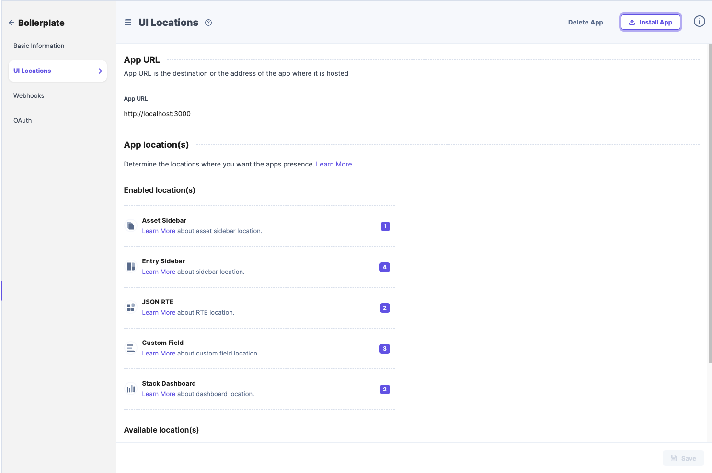
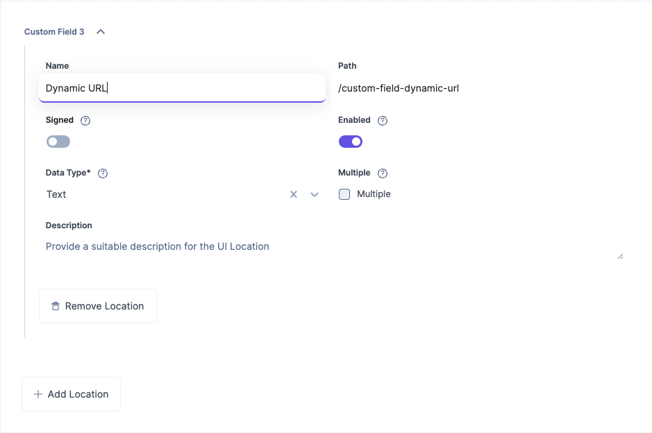
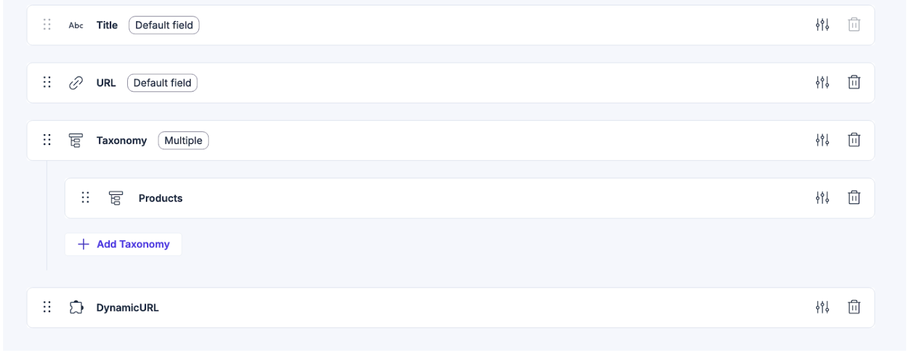

# Contentstack Marketplace App Boilerplate

You will need to set up the Application within Contentstack Developer Hub.

## Dynamic URL

To use the Dynamic URL custom field follow the below steps.

1. You will need to clone this repo and run it locally at http://localhost:3000/ or host it and provide the URL where the extension lives.
2. Create a custom field app location
   

3. Create the custom field route based on the pathing inside your application. This example uses `/custom-field-dynamic-url` and the type is `Text`
   

4. Go to your content model and create a custom field and select the custom field you just created
   

The app is hardcoded and these rules have to be followed:

1. This field only works after an entry has been **\*saved**
2. Category (category) field that prepends to the title
3. Title (title) a default field in Contentstack
4. URL (url) a default field in Contentstakc

## References

- [Marketplace App Boilerplate](https://www.contentstack.com/docs/developers/developer-hub/marketplace-app-boilerplate/)
- [Marketplace Boiler Plate](https://github.com/contentstack/marketplace-app-boilerplate)
