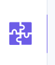
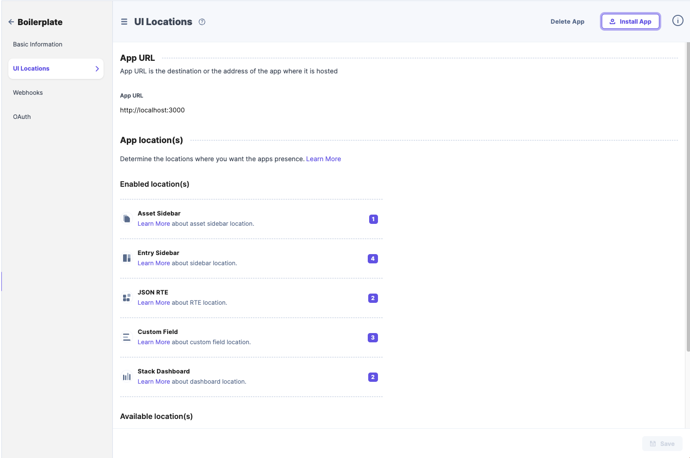
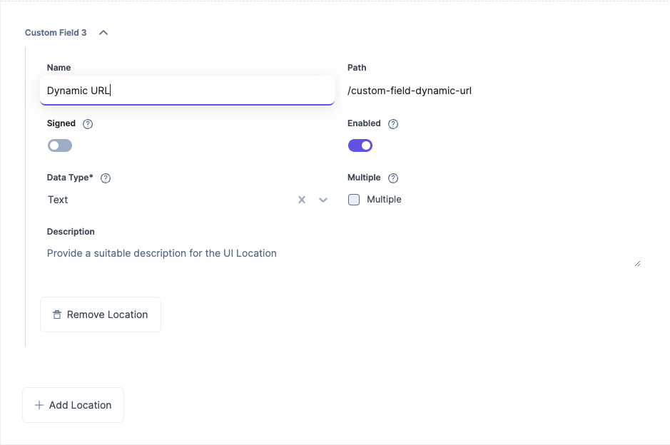
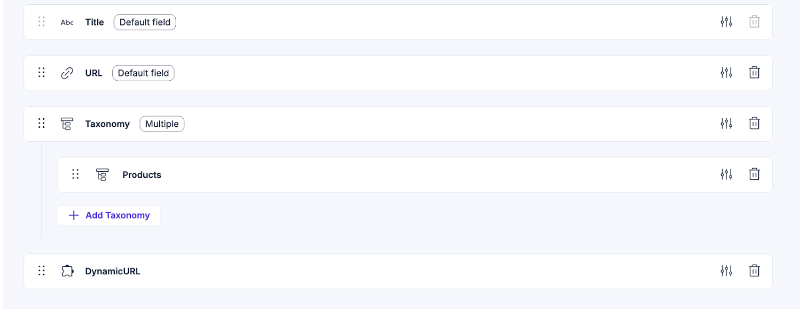

# Developing Dynamic URL Structures via Contentstack Taxonomy


### Description

This repository offers a foundational application that enables users to generate dynamic URLs within Contentstack by leveraging its taxonomy system. It serves as a starting point for building flexible, SEO-friendly URL structures based on content categories and hierarchies.

## Introduction 

Imagine you’re building a site with hundreds of articles or products, organized by categories like “Tech,” “Lifestyle,” and “Travel.” Manually managing URLs can quickly become overwhelming, especially when content changes or grows. This solution leverages Contentstack’s taxonomy system to automatically generate dynamic URLs—like /tech/latest-gadgets or /travel/luxury/beaches—based on how content is structured.

For developers, this means less time hardcoding routes and more flexibility as content evolves. Business users benefit from SEO-friendly URLs that boost discoverability and user engagement without additional dev work. As the site scales, this approach ensures consistent URL structures and streamlines future updates, reducing operational overhead and minimizing maintenance costs.

## Legal Disclaimer

This solution is provided as a **proof of concept** and is offered “**as-is**” without any warranties, expressed or implied. It is not officially supported, maintained, or guaranteed to function as intended in all environments.

### Important Notice to Users:

- You are **strongly encouraged** to implement comprehensive **testing**, **validation**, and **security measures** before using this code in production or any critical environment.
- The use of this code is entirely at your own risk. Ensure it aligns with your organization’s standards, practices, and compliance requirements.
- Contentstack disclaims all liability for any **damages**, **losses**, or **security issues** that may arise directly or indirectly from the use, misuse, or modification of this code.
- By using this repository, you acknowledge that **Contentstack** holds no responsibility for any consequences, including but not limited to **data breaches**, **system failures**, or **operational issues**.

## Requirements
- Owner/Admin Role within your Contentstack Stack or Org.
- Access to Contentstack [Developer Hub](https://www.contentstack.com/docs/developers/developer-hub) and [Taxonomy](https://www.contentstack.com/docs/developers/taxonomy).
- NPM and Node.js
- Typescript
- VS Code or other IDEA

## Steps

### Install and Run the Application

1. Clone this repository locally.
2. Install the dependencies. ```npm i```.
3. Run the application ```nmp start```. The default is http://localhost:3000/. Alternatively, you can host it and provide the URL in the Developer Hub App Configuration later.

### Create the App in Developer Hub
1. At the Organization level, on the left-hand sidebar towards the bottom, click the Developer Hub icon.
   

2. On the top right of your screen create a New App.
   

3. Provide the name for the app **Dynamic URL Field** and choose Stack App.
   

4. 


 
  
6. Create a custom field app location
   

7. Create the custom field route based on the pathing inside your application. This example uses `/custom-field-dynamic-url` and the type is `Text`
   

8. Go to your content model and create a custom field and select the custom field you just created
   

The app is hardcoded and these rules have to be followed:

1. This field only works after an entry has been **\*saved**
2. Category (category) field that prepends to the title
3. Title (title) a default field in Contentstack
4. URL (url) a default field in Contentstakc

## References

- [Marketplace App Boilerplate](https://www.contentstack.com/docs/developers/developer-hub/marketplace-app-boilerplate/)
- [Marketplace Boiler Plate](https://github.com/contentstack/marketplace-app-boilerplate)
