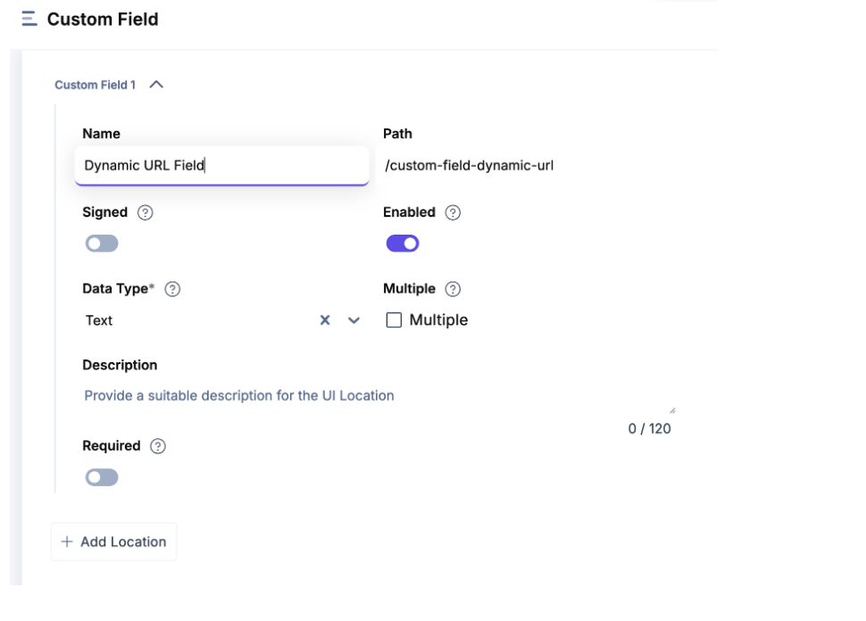

# Dynamic URL using Taxonomy POC

This app enables dynamic URL generation for Contentstack entries using taxonomy terms. It is designed as a custom field extension that can be run locally or hosted, and integrated into your stack via the Developer Hub.

---

## Table of Contents

1. [Overview](#overview)
2. [Features](#features)
3. [Installation & Setup](#installation--setup)
4. [Configuration](#configuration)
5. [Adding the App to Developer Hub](#adding-the-app-to-developer-hub)
6. [Content Model Requirements](#content-model-requirements)
7. [How It Works](#how-it-works)
8. [Usage Guidelines](#usage-guidelines)
9. [Known Limitations](#known-limitations)
10. [Reference & Resources](#reference--resources)

---

## Overview

The Dynamic URL using Taxonomy POC app allows you to generate SEO-friendly, hierarchical URLs for your entries based on selected taxonomy terms. This is especially useful for sites that require URLs reflecting content categories, such as `/category/subcategory/title`.

---

## Features

- **Dynamic URL Generation:** URLs are built by combining selected taxonomy terms and the entry title.
- **Custom Field Extension:** Easily add as a custom field in your content model.
- **Order Preservation:** The order of selected taxonomy terms determines their order in the URL.
- **Live Preview:** See the generated URL after saving the entry.

---

## Installation & Setup

1. **Clone the Repository:**
   ```bash
   git clone <your-repo-url>
   cd <your-repo-directory>
   ```

2. **Install Dependencies:**
   ```bash
   npm install
   ```

3. **Run the App Locally:**
   ```bash
   npm start
   ```
   The app will be available at [http://localhost:3000/](http://localhost:3000/).

   > **Alternatively:** You can host the app and use the hosted URL for the extension.

---

## Configuration

1. **Update the Taxonomy UID:**
   - Open `CustomField.tsx`.
   - Replace the hardcoded taxonomy UID with your own taxonomy’s UID.

   ```typescript
   // Example
   const TAXONOMY_UID = 'your-taxonomy-uid-here';
   ```

---

## Adding the App to Developer Hub

1. **Register the App:**
   - Go to Contentstack Developer Hub.
   - Create a new app and set the app location to your running app URL (e.g., `http://localhost:3000/`).

2. **Create a Custom Field App Location:**
   - Add a new app location for a custom field.
   - Example:
     

3. **Set Up the Custom Field Route:**
   - Use a route such as `/custom-field-dynamic-url`.
   - Set the type to `Text`.
   - Example:
     

4. **Add the Custom Field to Your Content Model:**
   - In your content type, add a new custom field and select the one you just created.
   - Example:
     

---

## Content Model Requirements

Your content type should include the following fields:

- **Title** (`title`): Default field in Contentstack.
- **URL** (`url`): Default field in Contentstack.
- **Taxonomy** (`taxonomy`): Field for taxonomy terms.
- **Custom Field**: The dynamic URL custom field you just set up.

---

## How It Works

- The custom field generates a URL by prepending the selected taxonomy terms (in order) to the entry title.
- The generated URL is saved in the `url` field.
- The field only updates after the entry is **saved**.
- The order of taxonomy terms is preserved in the URL structure.

**Example:**
If you select taxonomy terms `News > Company` and the title is `Quarterly Results`, the generated URL will be:
```
/news/company/quarterly-results
```

---

## Usage Guidelines

- **Save First:** The dynamic URL field only works after the entry has been saved at least once.
- **Order Matters:** Select taxonomy terms in the order you want them to appear in the URL.
- **Field Names:** The app expects the following field names: `category` (taxonomy), `title`, and `url`.
- **Editing:** If you change the taxonomy selection or title, save the entry again to update the URL.
- **Taxonomy Selection:** You must save the entry for the order of taxonomy terms to persist.

---

## Known Limitations

- The app is currently hardcoded for the field names: `category`, `title`, and `url`.
- Only works after the entry is saved (not on initial creation).
- Only supports one taxonomy field per content type.
- Does not support custom URL overrides or additional URL logic out-of-the-box.

---

## Reference & Resources

- [Contentstack Developer Hub Documentation](https://www.contentstack.com/docs/developers/developer-hub/)
- [Contentstack Taxonomy Documentation](https://www.contentstack.com/docs/developers/taxonomy/)

---

**Summary:**  
- Clone and run the app.
- Update the taxonomy UID in `CustomField.tsx`.
- Register and configure the app in Developer Hub.
- Add the custom field to your content model.
- Use and save entries to generate dynamic URLs based on taxonomy.

---

